# 🗺️ CaseStudy Engine: Functional Map

Tài liệu này phân rã toàn bộ chức năng của hệ thống để hỗ trợ việc quản lý dự án và phân chia công việc trong Team.

---

## 1. Sơ đồ phân rã chức năng (FDD)

```mermaid
graph TD
    Root[CaseStudy Engine] --> Auth[1. Hệ thống Xác thực]
    Root --> Designer[2. Bộ thiết kế kịch bản Designer]
    Root --> Library[3. Thư viện Tài nguyên]
    Root --> Simulator[4. Chế độ Mô phỏng Simulator]
    Root --> Backend[5. Bộ não AI & Dữ liệu]

    %% 1. Authentication
    Auth --> Login[Đăng nhập / Đăng ký]
    Auth --> JWT[Quản lý Phiên Token JWT]

    %% 2. Designer
    Designer --> EnvDesign[Dựng môi trường 3D]
    Designer --> PersonaConfig[Cấu hình Persona & Tính cách]
    Designer --> RewardSetup[Thiết lập Logic Chấm điểm]
    Designer --> Persistence[Lưu kịch bản vào MongoDB]

    %% 3. Library
    Library --> Browse[Duyệt danh sách Env/Persona]
    Library --> Search[Tìm kiếm & Lọc tài nguyên]

    %% 4. Simulator
    Simulator --> Roleplay[Tương tác NPC - Multi-Agent]
    Simulator --> ScoreSystem[Chấm điểm thời gian thực]
    Simulator --> EnvInter[Tương tác Vật thể Thông minh]
    Simulator --> Feedback[Báo cáo & Nhận xét cuối buổi]

    %% 5. AI Backend
    Backend --> LangGraph[Điều phối Multi-Agent]
    Backend --> RAG[Tru xuất Tri thức & Trích dẫn]
    Backend --> DB[Quản lý Cơ sở dữ liệu MongoDB]
```

---

## 2. Mô tả chi tiết Module

### 🏗️ Module 1: Authentication (Xác thực)
- **Vai trò:** Cổng vào bảo mật của ứng dụng.
- **Trạng thái Unity:** `SimulationState.MainMenu` -> `SimulationState.Login`.
- **Kết nối Backend:** Endpoint `/api/login` & `/api/register`.

### 🎨 Module 2: Case Designer (Thiết kế)
- **Vai trò:** Cho phép người dùng tạo ra các tình huống mới.
- **Tính năng chính:** Kéo thả vật thể, nhập tính cách AI, thiết lập quy tắc cộng/trừ điểm.
- **Output:** Xuất ra file JSON theo chuẩn `STATE_SPEC.md`.

### 📚 Module 3: Asset Library (Thư viện)
- **Vai trò:** Quản lý tài sản (Mô hình 3D, nhân vật).
- **Tính năng chính:** Hiển thị danh sách các môi trường (Sảnh khách sạn, phòng khám) và các Persona có sẵn.

### 🎭 Module 4: Simulator (Mô phỏng)
- **Vai trò:** Nơi diễn ra sự tương tác giữa Người và AI.
- **Tính năng chính:** Chatbox tương tác, nhân vật thực hiện hành động/cảm xúc, chấm điểm dựa trên hành vi người dùng.

### 🧠 Module 5: AI & Data (Hậu phương)
- **Vai trò:** Xử lý logic thông minh và lưu trữ.
- **Công nghệ:** FastAPI, MongoDB, LangGraph (Multi-Agent).
