# 🗺️ CaseStudy Engine: Functional Map

This document decomposes all system functionalities to support project management and team task allocation.

---

## 1. Feature-Driven Decomposition (FDD)

```mermaid
graph TD
    Root[CaseStudy Engine] --> Auth[1. Authentication System]
    Root --> Designer[2. Case Designer Tool]
    Root --> Library[3. Asset Library]
    Root --> Simulator[4. Simulation Mode]
    Root --> Backend[5. AI Brain & Data]

    %% 1. Authentication
    Auth --> Login[Login / Register]
    Auth --> JWT[JWT Session Token Management]

    %% 2. Designer
    Designer --> EnvDesign[3D Environment Setup]
    Designer --> PersonaConfig[Persona & Trait Configuration]
    Designer --> RewardSetup[Scoring Logic Setup]
    Designer --> Persistence[Save Cases to MongoDB]

    %% 3. Library
    Library --> Browse[Browse Env/Persona List]
    Library --> Search[Search & Filter Assets]

    %% 4. Simulator
    Simulator --> Roleplay[NPC Interaction - Multi-Agent]
    Simulator --> ScoreSystem[Real-time Scoring]
    Simulator --> EnvInter[Smart Object Interaction]
    Simulator --> Feedback[Post-session Report & Feedback]

    %% 5. AI Backend
    Backend --> LangGraph[Multi-Agent Orchestration]
    Backend --> RAG[Knowledge Retrieval & Citation]
    Backend --> DB[MongoDB Database Management]
```

---

## 2. Module Detailed Descriptions

### 🏗️ Module 1: Authentication
- **Role:** Application security entry gate.
- **Unity State:** `SimulationState.MainMenu` -> `SimulationState.Login`.
- **Backend Connection:** Endpoint `/api/login` & `/api/register`.

### 🎨 Module 2: Case Designer
- **Role:** Enables users to create new scenarios.
- **Key Features:** Drag-and-drop objects, enter AI traits, configure point bonus/penalty rules.
- **Output:** Exports a JSON file conforming to `STATE_SPEC.md`.

### 📚 Module 3: Asset Library
- **Role:** Manages assets (3D models, characters).
- **Key Features:** Displays a list of available environments (Hotel lobby, clinic) and Personas.

### 🎭 Module 4: Simulator
- **Role:** Where human-AI interaction takes place.
- **Key Features:** Interactive chatbox, character performs actions/expressions, scoring based on user behavior.

### 🧠 Module 5: AI & Data
- **Role:** Intelligent logic processing and storage.
- **Technology:** FastAPI, MongoDB, LangGraph (Multi-Agent).
